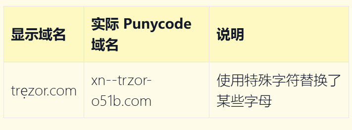
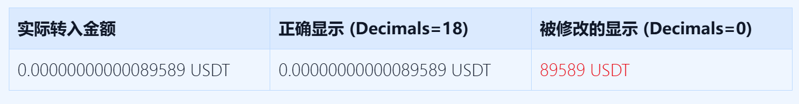

# segment7

**GitHub ID:** segment7

**Telegram:** @philointuit

## Self-introduction

segment7，四川成都人，UoL cs在读，正在使用lens开发链上同人创作社交平台Ordinary码头。

## Notes

<!-- Content_START -->
# 2025-08-04

## 识别真假域名
Punycode 是一种编码系统，允许将非 ASCII 字符（如 [西里尔字母](https://en.wikipedia.org/wiki/Cyrillic_script) 、中文等）转换为 ASCII 字符，以便在域名系统中使用。攻击者经常利用视觉上相似的字符创建看似合法的域名。     
例如，某些特殊字符看起来与拉丁字母几乎相同，但它们是不同的字符： 可以使用 [Punycoder](https://www.punycoder.com/) 来转换 Unicode 和 Punycode 域名。

## 以太坊的一个节点接入超级计算机/量子计算机会发生什么？

| 计算机类型        | 可能的使用场景                               | 对以太坊的影响                                |
| -------------------- | ------------------------------------------------ | ------------------------------------------------- |
| **Supercomputer**   **超级计算机**   | Faster block processing, MEV search, simulations更快的区块处理、MEV 搜索、网络模拟 | Improves performance, no protocol-level risk提升性能，但不会对协议层造成风险      |
| **Quantum Computer**    **量子计算机** | Breaks ECDSA (in theory), fakes signatures理论上可破解 ECDSA、伪造签名       | **Critical threat**, but only when quantum scales**严重威胁**，但仅在量子计算能力足够强时才会发生 |

# 2025-08-05

## 1. 警惕Permit2代币授权
Permit2 的工作方式与传统代币授权不同：

- 传统模式：您直接将代币授权给特定合约（例如 Uniswap）
- Permit2 模式：您将代币授权给 Permit2 合约，然后由 Permit2 在内部管理权限

这创建了一个两层授权系统：

1. 代币对 Permit2 的授权（在区块链浏览器中可见）
2. Permit2 内部的权限（在标准区块链浏览器中不可见）

**漏洞：** 如果您只撤销了代币对 Permit2 的授权，但没有撤销内部权限，一旦您再次授权 Permit2，攻击者仍然可以窃取您的代币。

**如何保护自己：**
- 对签名请求保持谨慎，特别是那些请求**无限制数量**的请求
- 验证签名请求中的接收者地址
- 使用显示详细签名信息的硬件钱包
- （使用像 ScamSniffer 的 Permit2 授权管理这样的工具来查看和撤销 Permit2 内部权限）

## 2. 警惕恶意 RPC 提供商
恶意 RPC 提供商可以：

- 拦截并修改您的交易，将资金重定向到攻击者的地址
- 显示虚假的代币余额，让您认为您收到了不存在的付款
- 提供虚假的交易状态，让您认为交易失败并诱使您重试
- 收集您的交易历史和钱包活动数据

# 2025-08-06

## 1. ETH签名数据库
由于哈希算法 `keccak256` 是不可逆的，无法反向解码，可用 公开数据库 查询常见函数选择器名称

**常用公开数据库：**  
- Ethereum Signature Database - [4byte.directory](https://www.4byte.directory/)  
- [openchain.xyz](https://openchain.xyz/)

## 2. 警惕代币精度设置

## 3. 警惕 `aggregate` & `multicall` 函数
始终仔细核实签名请求，特别是捆绑交易  
对像 aggregate 或 multicall 的函数保持警惕，因为它们可能隐藏恶意操作

<!-- Content_END -->