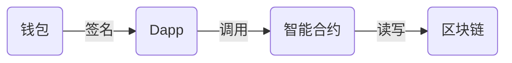

# silly zhe

**GitHub ID:** Sillyzhe

**Telegram:** @silly zhe

## Self-introduction

传统web2前端开发，和大家共同学习进步

## Notes

<!-- Content_START -->
# 2025-08-06

======================================================================

## 技术岗

### 前端工程师
**主要职责**：

- 设计和开发基于区块链技术的前端应用，支持去中心化平台的交互。
- 通过 React、Vue 等框架实现高效的用户界面，支持钱包连接、交易签名、信息验证等功能。
- 集成并优化智能合约的前端交互，确保链上数据与用户界面的无缝连接。
- 与后端团队协作，基于 GraphQL 或 RESTful API 获取链上和链下数据。
- 持续优化前端性能，提升用户体验，确保在不同设备和浏览器上的兼容性。
- 关注 Web3 技术趋势，参与技术评审与分享，不断优化产品架构与代码质量。

**职位要求**：
- 精通 HTML、CSS、JavaScript，熟悉 React、Vue 等前端框架，能够独立构建复杂的 UI 界面。
- 熟悉 Web3.js、Viem、Metamask 等 Web3 技术栈，能够与智能合约进行交互。（现在 Ethers.js / Web3.js 已经不怎么使用了，大家现在基本上都是用的 **Viem**）
- 了解常用的区块链网络，如以太坊、Solana 等，具备 Dapp 开发经验者优先。
- 熟悉 Git 版本管理工具，具备良好的代码编写规范，注重代码可维护性。
- 良好的沟通能力和团队协作精神，能够在快速发展的环境中高效工作。
- 具有良好的问题解决能力，能在面对复杂的技术难题时，提出创新的解决方案。
- 有开源项目或 Web3 相关项目的经验优先。

```
# 常用技术栈
- HTML5
- CSS3
- JavaScript (ES6+)
- React / Vue
- TypeScript
- Next.js
- Ethers.js / Web3.js / Viem

```

### 后端工程师
**主要职责**：
- 开发维护DApp后端服务
- 构建RESTful/GraphQL API
- 优化链上数据交互效率
- 研究应用新兴区块链技术

**职位要求**：
- 精通Node.js/Go/Python
- 熟悉Web3工具链和数据库技术
- 了解智能合约交互
- 熟悉容器化技术

```
常用技术栈：
- Node.js/Go
- GraphQL
- PostgreSQL
- Docker
```

### 智能合约工程师
**主要职责**：
- 设计开发安全可靠的智能合约
- 使用Solidity实现各类DApp需求
- 进行全面的合约测试和审计
- 持续优化合约性能

**职位要求**：
- 精通Solidity和开发框架
- 深刻理解区块链原理
- 熟悉安全审计标准
- 具备DeFi/NFT开发经验

```
常用工具：
- Hardhat
- Foundry
- Slither
```

## 非技术岗

### 产品经理
**核心职责**：
- 规划区块链产品路线
- 设计代币经济模型
- 协调技术团队实现需求
- 跟踪行业趋势迭代产品

**能力要求**：
- 熟悉主流公链特性
- 了解智能合约运作机制
- 精通用户调研方法
- 具备经济模型设计能力

### 社区运营
**工作重点**：
- 制定社区增长策略
- 策划线上/线下活动
- 管理多语言社区
- 分析用户行为数据

**必备技能**：
- 熟悉Discord/TG运营
- 精通内容创作
- 具备危机处理能力
- 了解DAO治理机制

# 2025-08-05

==========================================================================

# 以太坊概览

## 1. 以太坊介绍

以太坊（Ethereum）是一个开源的**去中心化区块链平台**，通过其原生加密货币以太币（Ether，简称 ETH）提供去中心化的以太虚拟机（EVM）来处理点对点合约。

以太坊的核心创新在于 **智能合约（Smart Contracts）** 。智能合约是存储在区块链上的可执行代码，能够在满足预设条件时自动执行操作，无需人工干预。这一特性使得以太坊不仅是数字货币的载体，更是构建去中心化应用（Dapps）、去中心化金融（DeFi）、非同质化代币（NFT）等生态系统**的基础设施**。

以太坊的定位是“区块链 2.0”的代表。如果说比特币是区块链 1.0 的象征（专注于货币属性），那么以太坊则通过智能合约和可编程性，推动区块链技术向更广泛的应用场景拓展。其目标是成为全球范围内的“世界计算机” ，为开发者提供构建复杂应用的工具和环境。

## 2. Ethereum 与 Bitcoin 的差异

|维度	|比特币（Bitcoin）	|以太坊（Ethereum）|
|--|--|--|
目标与定位|	去中心化的数字货币，强调安全、稳定和稀缺性（总量 2100 万枚）|	去中心化平台，支持智能合约和 Dapps，定位为“区块链 2.0”|
编程能力|	脚本语言有限，仅支持简单的交易验证逻辑|	图灵完备的编程语言（如 Solidity），可开发复杂智能合约|
共识机制|	工作量证明（PoW），矿工通过算力竞争记账权|	从 PoW 转向权益证明（PoS），通过 The Merge 实现能源效率优化|
交易速度|	每 10 分钟生成一个区块，交易确认较慢|	区块时间约 12 秒，交易确认更快，适合高频应用|
经济模型|	总量固定，强调抗通胀属性|	供应灵活，通过 EIP-1559 等机制可能呈现通缩趋势|

以太坊的灵活性使其能够支持更多应用场景，例如 DeFi（借贷、交易）、NFT（数字艺术品）、DAO（去中心化自治组织）等，而比特币则更专注于作为**“数字黄金”**存储价值。

## 3. 以太坊的定位与演进

其中最关键的是从 **工作量证明（PoW）转向权益证明（PoS）** ，以及被称为** The Merge（合并）** 的里程碑事件

### 1. 以太坊1.0

以太坊最初像比特币一样，使用 PoW（工作量证明） 机制来维护网络安全。简单来说：

- 矿工通过计算机算力“挖矿”，争夺打包交易的权利。
- 矿工需要消耗大量电力资源，竞争激烈。
- 成功打包区块的矿工会获得新生成的 ETH 奖励。
#### 问题

- **能耗高**：全球以太坊矿工的电力消耗相当于一个小国家的用电量。
- **扩展性差**：每秒只能处理约 30 笔交易（TPS），速度慢、费用高

### 2. 以太坊 2.0 与 The Merge：从双链并行到完美合并

#### PoS 机制详解

**验证者如何工作**：

- **准入门槛**：质押 32 ETH 成为验证者
- **工作方式**：系统随机选择验证者来提议和验证区块
- **奖励机制**：验证者获得新发行的 ETH + 交易费用
- **惩罚机制**：作恶者质押的 ETH 被销毁（Slashing）


**相比 PoW 的优势**：

- **能耗降低 99.95%**：无需大量电力和硬件
- **经济安全性**：攻击成本约需控制全网 67% 的质押 ETH（价值数百亿美元）
- **最终确定性**：区块确认更快、更可靠
### 3. 未来升级路线图
#### 1. 分片技术演进——从执行分片到数据分片
**原计划 vs 新策略**：

**原计划**：将以太坊分成 64 条分片链，每条独立处理交易
**策略调整**：专注于数据分片，配合 Layer 2 实现扩容

**当前方案**：
数据可用性分片：为 Rollup 提供更多、更便宜的数据存储空间
配合 Layer 2：主网专注安全和数据可用性，Layer 2 负责大量交易处理
EIP-4844 先行：通过 Blob 交易为分片技术做准备

**预期效果**：
Layer 2 成本进一步降低 90%+
以太坊主网专注于做“结算层”和“数据可用性层”

#### 2. EIP-4844（Cancun 升级）——“省钱神器”
Layer 2 工作原理简述：
- Layer 2 在链下批量处理大量交易
- 定期将交易数据“打包”提交到以太坊主网
- 主网验证数据正确性，提供最终安全保障

EIP-4844 的突破：
- **问题**：以前 L2 提交数据需要使用常规交易，成本高昂
- **解决方案**：引入专门的“Blob 交易”类型，数据存储成本大幅降低
- **技术细节**：Blob 数据会在一定时间后自动删除，不会永久占用主网存储


 **实际效果**：
- L2 交易费用降低 70% - 90%
- Arbitrum、Optimism 等主流 L2 费用降至几美分
- 状态：已于 2024 年 3 月 13 日上线主网，运行稳定

#### 3. ZK-Rollup 技术——“批量验证，一步到位”
**技术原理**：

- **批量处理**：在链下一次性处理数百笔交易
- **零知识证明**：生成一个简洁的“正确性证明”
- **主网验证**：以太坊只需验证这个证明，无需重新执行所有交易

**优势**：

- **速度快**：主网只需验证一个证明而非数百笔交易
- **成本低**：多笔交易分摊验证成本
- **安全性高**：继承以太坊主网的安全性

#### 4. 其他重要升级方向

- **EIP-1559 成果**：已实现基础费用机制，但 Gas 费仍受网络拥堵影响较大
- **Verkle 树技术**：优化状态存储结构，减少节点同步所需的数据量
- **执行环境优化**：提升 EVM 性能，支持更复杂的智能合约应用


## 4. 以太坊生态概览：L1、L2、Sidechains 等

以太坊的生态系统由多层架构组成，包括** L1（主网）、L2（二层扩展解决方案）、侧链（Sidechains）** 等，共同支持高吞吐量和低费用的交易处理。

### 1. Layer1(L1) 
- 以太坊主网——核心区块链，负责最终安全性和共识
- EVM——以太坊虚拟机，执行智能合约代码
- 账户系统——外部账户（EOA Externally Owned Account）——用户控制、与私钥关联；合约账户（CA）——智能合约代码控制；共同构成网络基础

### 2. Layer2(L2)
- Rollup:将交易**批量处理**后提交到L1，**降低gas费**
    - Optimistic Rollup：假设交易合法，仅在**争议时**验证
    - ZK Rollup：通过零知识证明——过程中除“该命题为真”之事外，不泄露任何资讯。验证交易，无需链上争议
### 3. 测链
独立运行的链，通过桥接与主网交互

### 4. 以太坊生态分层架构

#### 1. 应用层（Application Layer）
- Defi应用
- NFT平台
- 钱包应用
- DAO工具

#### 2. 协议层（Protocol Layer）
- 共识层客户端
- 执行层客户端
- 核心协议

#### 3. 拓展层（Scaling Layer）
- Layer2 Rollups
- 测链
- 状态通道

## 5. 以太坊文化与价值

深受**密码朋克运动**影响，体现技术赋权个人，重塑社会协作的愿景

### 核心价值观
#### - 去中心化治理（Decentralization）
#### - 无需许可与开放性（Permissionless & Open）
#### - 抗审查性（Censorship Resistance）
#### - 密码朋克精神（Cypherpunk Etohs）
#### - 公共物品导向 （Public Goods Orientation）
#### - 可持续发展理念

## 6. 以太坊核心机制： 从账户到执行的完整链路

我们平时使用**账户系统**里面的 外部账户（EOA） 与区块链中的其他用户的 外部账户（EOA） 或者与智能合约所在的 合约账户（CA） 进行交互，而其中的**Gas 模型**是支撑整个网络的经济基础， Gas 模型 和其他经济来源支撑着全球的**以太坊虚拟机（EVM）**来实现以太坊网络。

### 账户系统：数字身份

#### 外部账户（EOA）
私钥是控制账户的钥匙，必须严格保密
公钥是加密算法生成的唯一地址
#### 合约账户（CA）
代码驱动。不能主动发起交易，只能通过EOA触发

每个账户都包含四个关键字段
- Nonce 防止重复交易的计数器（EOA记录发送次数，CA记录创建合约次数）
- 余额 账户持有的ETH数量（单位是Wei，最小单位 1 ETH 等于 10^18 wei，1Gwei = 10^9 wei）
- CodeHash: EOA为空哈希，CA 存储合约字节码的哈希值
- StorageRoot： 记录账户数据的Mekkle树根哈希（如NFT归属关系）

### Gas模型：交易时的燃料费

Gas费用=**限额（Gas Limit）x 单价（Gas Price）**

#### 目的
- 激励矿工/验证者
- 防止资源滥用

在 EIP-1559 升级后，Gas Price 被拆分了：
以前Gas Price全部给了矿工。现在分成两部分
- 基础费用：每个区块都会有，自动计算，自动销毁（直接消失）帮助ETH通缩，物以稀为贵
- 小费：额外加的钱，鼓励矿工有限处理你的交易

### 以太坊虚拟机（EVM）：代码的执行引擎

以太坊的大脑，专门用来运行智能合约的虚拟计算机。保证结果都一致、可信任

特点
- 图铃完备：像真正的电脑，可以执行各种逻辑
- 全球同步：每个矿工、节点都会执行一遍合约，保证结果一样
- 隔离安全： 把合约“关”再一个小房间里，不允许它乱访问用户的数据和网络，保护隐私和安全

## 7. 一般流程与相似类比

### 一般流程

1. 用户通过EOA发起交易
2. 交易附带Gas参数
3. EVM执行合约代码
4. Gas费用按Gas Limit x Gas Price扣除

### 相似类比
- EOA = 个人钱包，私钥证明身份，可以发起任何交易
- CA = 智能保险箱，按照预设程序自动执行，满足条件才执行操作
- Gas = 计算资源费用
 - Gas Limit ：愿意支付的最大计算量
 - Gas Price ： 每单位计算的价格
- EVM = 全球共享计算机：所有节点同时运行相同的程序，确保结果一致且可信

# 2025-08-04

# 基本概念

## 1. 区块链是什么
区块链是一种去中心化的分布式账本技术，用于在网络节点之间安全、透明且不可篡改地记录事务数据。每条链由一系列按照时间顺序相连的“区块”组成，每个区块内部包含了多笔交易数据及元数据，确保了数据记录的完整性与可追溯性。
### 特性

#### 去中心化
区块链技术通过网络节点之间的合作，实现了去中心化的分布式账本。每个节点都有完整的账本副本，无需依赖中心化的服务器或机构，减少了单点故障的风险。
#### 安全
区块链利用密码学技术确保数据的安全性。每个区块的哈希值是根据前一个区块的哈希值计算得到的，因此任何篡改区块数据都需要重新计算后续区块的哈希值，导致整个区块链的验证失效。
#### 公开透明、匿名性
区块链的透明性体现在所有节点都可以查看账本的内容，包括交易记录、资产余额等。这使得区块链成为一个公开的记录系统，增强了透明度和可信度。但是没人知道这是你的钱包。
#### 不可篡改
区块链的不可篡改性体现在一旦数据写入区块链，就无法被修改或删除。这确保了数据的完整性和一致性，避免了因篡改而导致的不一致性问题。
#### 可扩展性
区块链技术的可扩展性使得可以增加新的节点加入网络，支持更多的交易和资产。这使得区块链成为一个适应不断变化的业务场景的解决方案。
#### 快速交易
无论金额多少以及你在什么地方，只要你的交易记录被打包在区块链中，交易就自动完成。相比传统的跨国汇款非常快速便捷。

## 2.什么是比特币
比特币是一种基于区块链技术的加密货币，是第一个真正的去中心化数字货币。它的设计目标是提供公开透明、匿名性、安全、可扩展性和快速交易等特性。

## 3.区块链的核心组成
#### 去中心化的网络和区块链
区块链将会有一条链来记录全部的信息，这条链将存在对应的去中心化网络中。 去中心化的网络，将由无数节点提供服务来维持网络运行。节点通过计算验证交易获得代币奖励。
#### 维持网络运行的代币激励
去中心化的网络由无数节点提供服务来维持网络运行，这些操作统称为挖矿。维持这些服务的人一般称之为矿工。矿工们维持网络运行需要奖励，就像你工作需要工资，在区块链中对矿工的奖励一般是代币，你经常听说的燃料费（Gas Fee）就是矿工们的“工资”。 你使用这个网络进行交易、转账、铸造 NFT 等等，均需要支付代币。如果你没有代币又想使用这个区块链网络服务，则需要进行代币之间交换或者法币交换。

### 一条区块链如何运行起来
1. **用户发起交易**：用户通过钱包应用发起转账、智能合约调用等操作
2. **交易广播**：交易信息被广播到整个网络中的各个节点
3. **节点验证**：网络中的矿工节点验证交易的合法性（余额是否足够、签名是否正确等）
4. **打包成块**：通过共识机制（如工作量证明），矿工将验证过的交易打包成新的区块
5. **链接上链**：新区块被添加到区块链上，更新全网的账本状态
6. **奖励发放**：成功打包区块的矿工获得代币奖励和交易手续费

## 4. 公链 vs 私链 vs 联盟链

### 公链=公共花园
公链是指所有节点都参与交易验证的区块链。它的交易是公开透明的，所有节点都可以查看交易记录。但是公链的交易验证成本较高，因为所有节点都需要参与验证。
- 成为节点的方法：
  - **无需申请**：任何人只要带着工具（比如手机、电脑）就能加入公园，成为维护者（节点）。
  - **自由进出**：你可以随时离开或回来，没人会拦你。
- 共同管理数据的模式：
  - **所有人可见**：公园里的所有活动（比如谁修剪了草坪、谁清理了垃圾）都会被公开记录在公告栏上，所有人都能看到。
  - **去中心化决策**：如果公园需要修路，大家会投票决定（共识机制），不需要某个领导拍板。
  - **缺点**：因为人太多，决策效率低（交易确认慢），维护成本高（比如电费、人力）。
### 私链=私人俱乐部

私链是指只有参与交易的节点才知道交易记录的区块链。私链的交易是匿名的，只有参与交易的节点才知道交易记录。私链的交易验证成本较低，因为只有参与交易的节点才需要验证。


- 成为节点的方法：
  - **严格审批**：想加入俱乐部？必须经过老板批准（比如交会员费、填写申请表）。
  - **固定成员**：一旦成为会员，你的权限由老板决定（比如能否查看账本、能否修改规则）。
- 共同管理数据的模式：
  - **数据完全私有**：账本只对会员开放，外人无法查看（比如你的消费记录只有你和老板知道）。
  - **老板说了算**：如果俱乐部要改规则（比如涨价），老板可以直接决定，不需要投票。
  - 优点：效率极高（因为只有少数人参与），隐私极强（数据不对外公开），但缺乏公链的透明性。
### 联盟链=多公司联合董事会
联盟链是指只有参与交易的节点才知道交易记录的区块链。联盟链的交易是匿名的，只有参与交易的节点才知道交易记录。联盟链的交易验证成本较低，因为只有参与交易的节点才需要验证。

- 成为节点的方法：
  - **需要邀请或申请**：如果你想加入董事会，必须得到其中一家公司的认可（比如你是某家银行的合作伙伴）。
  - **权限分级**：董事会成员可能分为两类：
    - **决策者（联盟核心成员）**：比如银行 A、银行 B，可以修改数据库规则。
    - **观察者（联盟普通成员）**：比如物流公司，只能查看数据但不能修改。
- 共同管理数据的模式：
  - **半公开数据**：数据库里的信息（比如客户信用评分）只有董事会成员能看到，外人无法访问。
  - **联合决策**：如果要修改数据库规则（比如增加新字段），需要董事会成员投票通过。
  - **优点**：效率比公链高（因为成员少），隐私比公链好（数据不对外公开），但不如私链灵活（需要多方协调）。

### 总结对比
| 区块链类型 | 节点加入方式 | 数据可见性 | 管理模式 | 适合场景 |
| --- | --- | --- | --- | --- |
| 公链 | 任何人自由加入 | 所有人可见 | 去中心化（大家投票） | 加密货币、公共存证 |
| 联盟链 | 需联盟成员邀请/审批 | 仅联盟成员可见 | 多中心化（董事会决策） | 供应链、金融协作 |
| 私链 | 由老板严格审批 | 仅内部成员可见 | 中心化（老板说了算） | 企业内部管理、审计 |

## 五. Web3 vs Web 3.0 vs Web2 的范式革命
### 1. Web2 时代
**核心特征**：
- **中心化控制**：数据存储在科技巨头的服务器（如 Google、Facebook）
- **用户角色**：内容生产者，但不拥有数据
- **商业模式**：广告驱动，平台抽取佣金
- **典型应用**：微信、抖音、亚马逊
**比喻**
> 就像租房子，你可以装饰（发内容），但房东（平台）随时能收回钥匙（封号）。


### 2. Web3.0 语义网
**核心特征**：

- **语义标记**：使用 RDF、OWL 等标准描述数据关系
- **结构化数据**：信息按照标准格式组织，便于机器理解
- **知识图谱**：构建实体间的语义关系网络
- **典型技术**：本体工程、语义查询语言（SPARQL）、链接数据
- 
 **关键区别**：
- ❌ 不是区块链技术，而是传统互联网的数据组织升级
- ❌ 主要不依赖 AI，而是通过标准化数据格式实现
- ✅ 与 Web3 可结合（语义标记 + 区块链存储）

**比喻**：
> 像把图书馆的每本书都贴上详细标签（作者、主题、关联书籍），让图书管理员能快速找到相关资料。
> 
### 3. Web3 去中心化互联网

**核心特征**：
- 数据主权归用户：用区块链存储身份和资产
- 无需信任中介：智能合约自动执行规则
**核心组件**：




**典型应用**：MetaMask、Uniswap、ENS

**核心创新**：

- **真正拥有数字资产**：你的 NFT 头像、游戏道具真正属于你，平台无法删除或收回
- **金融服务无门槛**：无需银卡行，用手机钱包就能借贷、理财、交易
- **应用可自由组合**：一个 DeFi 协议的流动性可以被其他应用直接调用，就像搭积木
- **内容永不消失**：文章、图片存储在分布式网络，不会因为平台关闭而丢失

**比喻**：
> 像自己买地盖房（数据自托管），用智能合约管理水电费（自动结算）。

### 4. 对比矩阵

|维度|	Web2|	Web 3.0|	Web3|
|--|--|--|--|
|控制权|	平台垄断|	部分开放|	用户自治|
|数据存储|	中心服务器|	混合存储	|区块链 / IPFS|
|支付系统|	信用卡 / 支付宝	|集成支付|	加密货币|
|典型技术|	JavaScript|	RDF / OWL|	智能合约|
|代表企业|	腾讯 / 阿里	|W3C / DBpedia|	Uniswap / ConsenSys|

### 5.常见误解澄清
1. Web3 ≠ Web 3.0

   - Web3 是区块链驱动的革命
   - Web 3.0 是语义网技术驱动的数据组织升级
2. Web3 不是万能的

   - 优势：金融、产权、隐私场景
   - 劣势：不适合高频社交（如微博）
3. 渐进式过渡

## 六. 去中心化的优势和挑战
### 优势
#### 1. 信任最小化
  去中心化网络无需依赖中心化第三方，交易和数据由共识算法和加密证明保障，降低了 “信任成本”。
#### 2. 抗审查与高弹性
  数据分布存储在多个节点，单点故障或审查攻击难以完全阻断网络，提升了系统的安全性和可用性。
#### 3. 用户自主管理
  用户通过私钥掌控资产与数据，平台无法随意更改或冻结账户，赋予个人更高的隐私权和所有权。
#### 4. 开放 创新生态
  区块链与智能合约构建了去中心化应用（Dapps）平台，任何开发者都可在此基础上创新并获得代币激励，促进了技术和商业模式的多样化。

### 挑战
#### 1. 可扩展性瓶颈
公链在节点众多时共识效率低下，吞吐量和延迟问题突出，目前各大项目正通过分片、Layer 2 方案等技术进行优化。

#### 2. 安全与治理难题
区块链的不可篡改特性虽能保证数据安全，但代码漏洞或治理失衡（如 DAO 中投票权集中）也可能导致严重损失。

#### 3.用户体验与成本
  完全去中心化的系统往往对普通用户不够友好，如私钥管理复杂、交易手续费浮动大，需要在易用性与去中心化程度之间权衡。

#### 4. 法律与监管问题
  区块链的匿名性和去中心化特性使得法律和监管变得复杂，不同国家和地区对区块链的法律支持程度不同，这可能导致跨地区业务的法律问题。


# 2025.07.29


<!-- Content_END -->
