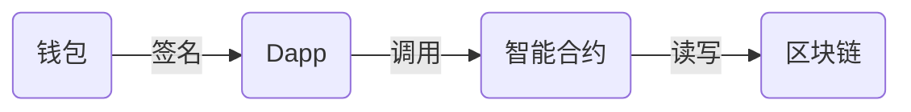

# silly zhe

**GitHub ID:** Sillyzhe

**Telegram:** @silly zhe

## Self-introduction

传统web2前端开发，和大家共同学习进步

## Notes

<!-- Content_START -->
# 2025-08-04

# 基本概念

## 1. 区块链是什么
区块链是一种去中心化的分布式账本技术，用于在网络节点之间安全、透明且不可篡改地记录事务数据。每条链由一系列按照时间顺序相连的“区块”组成，每个区块内部包含了多笔交易数据及元数据，确保了数据记录的完整性与可追溯性。
### 特性

#### 去中心化
区块链技术通过网络节点之间的合作，实现了去中心化的分布式账本。每个节点都有完整的账本副本，无需依赖中心化的服务器或机构，减少了单点故障的风险。
#### 安全
区块链利用密码学技术确保数据的安全性。每个区块的哈希值是根据前一个区块的哈希值计算得到的，因此任何篡改区块数据都需要重新计算后续区块的哈希值，导致整个区块链的验证失效。
#### 公开透明、匿名性
区块链的透明性体现在所有节点都可以查看账本的内容，包括交易记录、资产余额等。这使得区块链成为一个公开的记录系统，增强了透明度和可信度。但是没人知道这是你的钱包。
#### 不可篡改
区块链的不可篡改性体现在一旦数据写入区块链，就无法被修改或删除。这确保了数据的完整性和一致性，避免了因篡改而导致的不一致性问题。
#### 可扩展性
区块链技术的可扩展性使得可以增加新的节点加入网络，支持更多的交易和资产。这使得区块链成为一个适应不断变化的业务场景的解决方案。
#### 快速交易
无论金额多少以及你在什么地方，只要你的交易记录被打包在区块链中，交易就自动完成。相比传统的跨国汇款非常快速便捷。

## 2.什么是比特币
比特币是一种基于区块链技术的加密货币，是第一个真正的去中心化数字货币。它的设计目标是提供公开透明、匿名性、安全、可扩展性和快速交易等特性。

## 3.区块链的核心组成
#### 去中心化的网络和区块链
区块链将会有一条链来记录全部的信息，这条链将存在对应的去中心化网络中。 去中心化的网络，将由无数节点提供服务来维持网络运行。节点通过计算验证交易获得代币奖励。
#### 维持网络运行的代币激励
去中心化的网络由无数节点提供服务来维持网络运行，这些操作统称为挖矿。维持这些服务的人一般称之为矿工。矿工们维持网络运行需要奖励，就像你工作需要工资，在区块链中对矿工的奖励一般是代币，你经常听说的燃料费（Gas Fee）就是矿工们的“工资”。 你使用这个网络进行交易、转账、铸造 NFT 等等，均需要支付代币。如果你没有代币又想使用这个区块链网络服务，则需要进行代币之间交换或者法币交换。

### 一条区块链如何运行起来
1. **用户发起交易**：用户通过钱包应用发起转账、智能合约调用等操作
2. **交易广播**：交易信息被广播到整个网络中的各个节点
3. **节点验证**：网络中的矿工节点验证交易的合法性（余额是否足够、签名是否正确等）
4. **打包成块**：通过共识机制（如工作量证明），矿工将验证过的交易打包成新的区块
5. **链接上链**：新区块被添加到区块链上，更新全网的账本状态
6. **奖励发放**：成功打包区块的矿工获得代币奖励和交易手续费

## 4. 公链 vs 私链 vs 联盟链

### 公链=公共花园
公链是指所有节点都参与交易验证的区块链。它的交易是公开透明的，所有节点都可以查看交易记录。但是公链的交易验证成本较高，因为所有节点都需要参与验证。
- 成为节点的方法：
  - **无需申请**：任何人只要带着工具（比如手机、电脑）就能加入公园，成为维护者（节点）。
  - **自由进出**：你可以随时离开或回来，没人会拦你。
- 共同管理数据的模式：
  - **所有人可见**：公园里的所有活动（比如谁修剪了草坪、谁清理了垃圾）都会被公开记录在公告栏上，所有人都能看到。
  - **去中心化决策**：如果公园需要修路，大家会投票决定（共识机制），不需要某个领导拍板。
  - **缺点**：因为人太多，决策效率低（交易确认慢），维护成本高（比如电费、人力）。
### 私链=私人俱乐部

私链是指只有参与交易的节点才知道交易记录的区块链。私链的交易是匿名的，只有参与交易的节点才知道交易记录。私链的交易验证成本较低，因为只有参与交易的节点才需要验证。

- 成为节点的方法：
  - **严格审批**：想加入俱乐部？必须经过老板批准（比如交会员费、填写申请表）。
  - **固定成员**：一旦成为会员，你的权限由老板决定（比如能否查看账本、能否修改规则）。
- 共同管理数据的模式：
  - **数据完全私有**：账本只对会员开放，外人无法查看（比如你的消费记录只有你和老板知道）。
  - **老板说了算**：如果俱乐部要改规则（比如涨价），老板可以直接决定，不需要投票。
  - 优点：效率极高（因为只有少数人参与），隐私极强（数据不对外公开），但缺乏公链的透明性。
### 联盟链=多公司联合董事会
联盟链是指只有参与交易的节点才知道交易记录的区块链。联盟链的交易是匿名的，只有参与交易的节点才知道交易记录。联盟链的交易验证成本较低，因为只有参与交易的节点才需要验证。

- 成为节点的方法：
  - **需要邀请或申请**：如果你想加入董事会，必须得到其中一家公司的认可（比如你是某家银行的合作伙伴）。
  - **权限分级**：董事会成员可能分为两类：
    - **决策者（联盟核心成员）**：比如银行 A、银行 B，可以修改数据库规则。
    - **观察者（联盟普通成员）**：比如物流公司，只能查看数据但不能修改。
- 共同管理数据的模式：
  - **半公开数据**：数据库里的信息（比如客户信用评分）只有董事会成员能看到，外人无法访问。
  - **联合决策**：如果要修改数据库规则（比如增加新字段），需要董事会成员投票通过。
  - **优点**：效率比公链高（因为成员少），隐私比公链好（数据不对外公开），但不如私链灵活（需要多方协调）。

### 总结对比
| 区块链类型 | 节点加入方式 | 数据可见性 | 管理模式 | 适合场景 |
| --- | --- | --- | --- | --- |
| 公链 | 任何人自由加入 | 所有人可见 | 去中心化（大家投票） | 加密货币、公共存证 |
| 联盟链 | 需联盟成员邀请/审批 | 仅联盟成员可见 | 多中心化（董事会决策） | 供应链、金融协作 |
| 私链 | 由老板严格审批 | 仅内部成员可见 | 中心化（老板说了算） | 企业内部管理、审计 |

## 五. Web3 vs Web 3.0 vs Web2 的范式革命
### 1. Web2 时代
**核心特征**：
- **中心化控制**：数据存储在科技巨头的服务器（如 Google、Facebook）
- **用户角色**：内容生产者，但不拥有数据
- **商业模式**：广告驱动，平台抽取佣金
- **典型应用**：微信、抖音、亚马逊
**比喻**
> 就像租房子，你可以装饰（发内容），但房东（平台）随时能收回钥匙（封号）。

### 2. Web3.0 语义网
**核心特征**：

- **语义标记**：使用 RDF、OWL 等标准描述数据关系
- **结构化数据**：信息按照标准格式组织，便于机器理解
- **知识图谱**：构建实体间的语义关系网络
- **典型技术**：本体工程、语义查询语言（SPARQL）、链接数据
- 
 **关键区别**：
- ❌ 不是区块链技术，而是传统互联网的数据组织升级
- ❌ 主要不依赖 AI，而是通过标准化数据格式实现
- ✅ 与 Web3 可结合（语义标记 + 区块链存储）

**比喻**：
> 像把图书馆的每本书都贴上详细标签（作者、主题、关联书籍），让图书管理员能快速找到相关资料。
> 
### 3. Web3 去中心化互联网

**核心特征**：
- 数据主权归用户：用区块链存储身份和资产
- 无需信任中介：智能合约自动执行规则
**核心组件**：

**典型应用**：MetaMask、Uniswap、ENS

**核心创新**：

- **真正拥有数字资产**：你的 NFT 头像、游戏道具真正属于你，平台无法删除或收回
- **金融服务无门槛**：无需银卡行，用手机钱包就能借贷、理财、交易
- **应用可自由组合**：一个 DeFi 协议的流动性可以被其他应用直接调用，就像搭积木
- **内容永不消失**：文章、图片存储在分布式网络，不会因为平台关闭而丢失

**比喻**：
> 像自己买地盖房（数据自托管），用智能合约管理水电费（自动结算）。

### 4. 对比矩阵

|维度|	Web2|	Web 3.0|	Web3|
|--|--|--|--|
|控制权|	平台垄断|	部分开放|	用户自治|
|数据存储|	中心服务器|	混合存储	|区块链 / IPFS|
|支付系统|	信用卡 / 支付宝	|集成支付|	加密货币|
|典型技术|	JavaScript|	RDF / OWL|	智能合约|
|代表企业|	腾讯 / 阿里	|W3C / DBpedia|	Uniswap / ConsenSys|

### 5.常见误解澄清
1. Web3 ≠ Web 3.0

   - Web3 是区块链驱动的革命
   - Web 3.0 是语义网技术驱动的数据组织升级
2. Web3 不是万能的

   - 优势：金融、产权、隐私场景
   - 劣势：不适合高频社交（如微博）
3. 渐进式过渡

## 六. 去中心化的优势和挑战
### 优势
#### 1. 信任最小化
  去中心化网络无需依赖中心化第三方，交易和数据由共识算法和加密证明保障，降低了 “信任成本”。
#### 2. 抗审查与高弹性
  数据分布存储在多个节点，单点故障或审查攻击难以完全阻断网络，提升了系统的安全性和可用性。
#### 3. 用户自主管理
  用户通过私钥掌控资产与数据，平台无法随意更改或冻结账户，赋予个人更高的隐私权和所有权。
#### 4. 开放 创新生态
  区块链与智能合约构建了去中心化应用（Dapps）平台，任何开发者都可在此基础上创新并获得代币激励，促进了技术和商业模式的多样化。

### 挑战
#### 1. 可扩展性瓶颈
公链在节点众多时共识效率低下，吞吐量和延迟问题突出，目前各大项目正通过分片、Layer 2 方案等技术进行优化。

#### 2. 安全与治理难题
区块链的不可篡改特性虽能保证数据安全，但代码漏洞或治理失衡（如 DAO 中投票权集中）也可能导致严重损失。

#### 3.用户体验与成本
  完全去中心化的系统往往对普通用户不够友好，如私钥管理复杂、交易手续费浮动大，需要在易用性与去中心化程度之间权衡。

#### 4. 法律与监管问题
  区块链的匿名性和去中心化特性使得法律和监管变得复杂，不同国家和地区对区块链的法律支持程度不同，这可能导致跨地区业务的法律问题。

# 2025.07.29

<!-- Content_END -->
